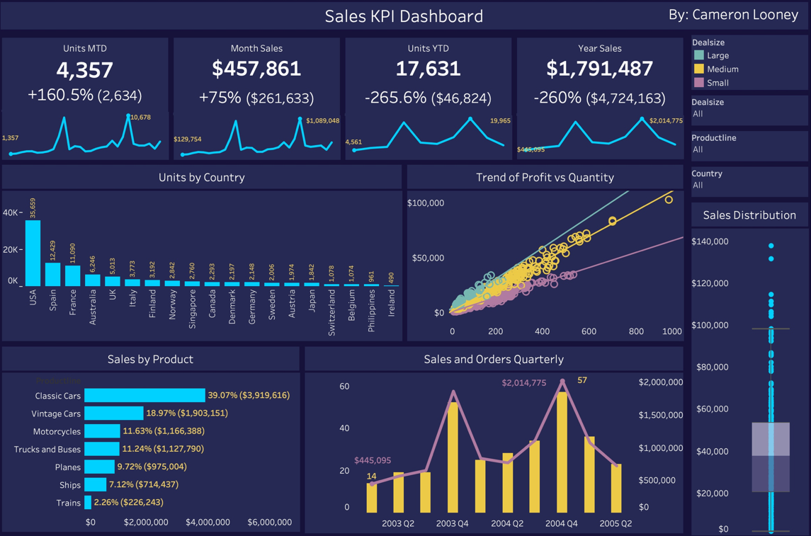

# Unicorn Companies Data Analysis

This was data analytics project exploring and visualising Unicorn Companies. 
A Unicorn is a private company that is worth more than $1B. I implemented a stack involving 
Python, Postgresql and Tableau. 

I used Python to clean and transform my data before I pushed it to a SQL database. I then used the databsse
to produce queries to examine the data and generate actionable insights that I could visualise. 

## How to Run the Project
All files are provided to reproduce this project. However the Tableau workbook is available 
here: 

Tableau: [link](https://public.tableau.com/app/profile/cameron.looney/viz/SalesKPI_16556590856360/Dashboard1)

## Key Callouts
- While per unit Large Deals generate the most revenue. When we consider the entire order medium deals actually generate the most revenue and thus should be the focus of the business. 
- The demand is seasonal which is evident by two large spikes in our trend data
- More focus should be placed on diversifying the business as the USA is nearly 40%

## Contact

LinkedIn - [cameronlooney](https://www.linkedin.com/in/cameronlooney/)

Email - cameronlooney18@gmail.com

(<a href="#top">back to top</a>)
